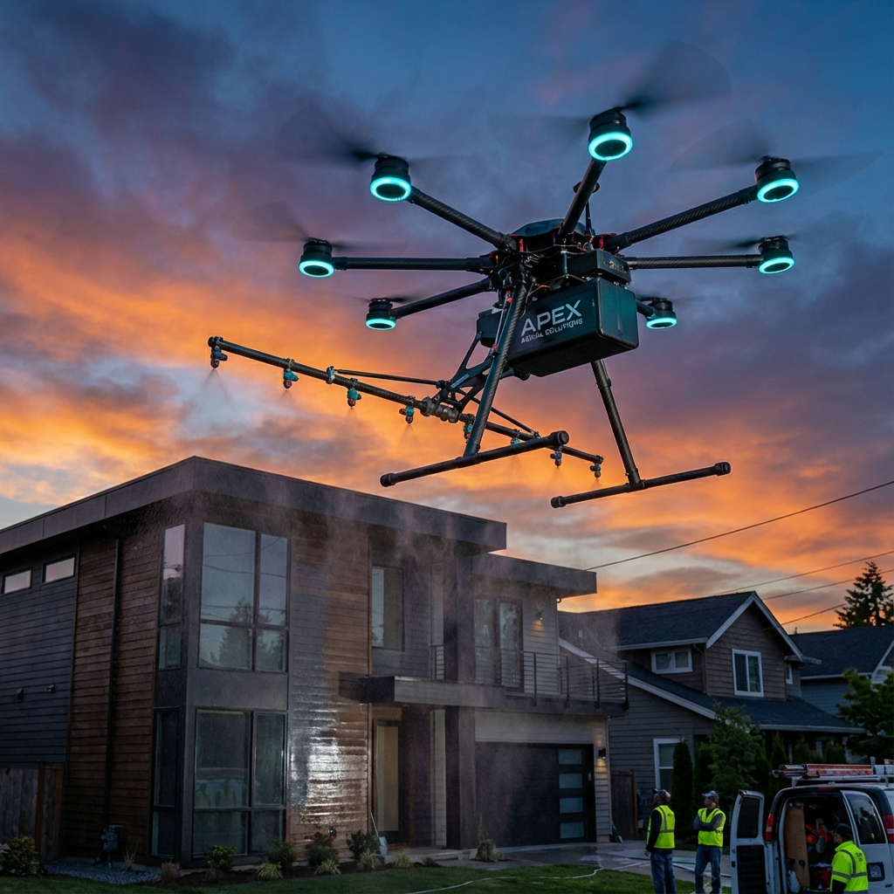
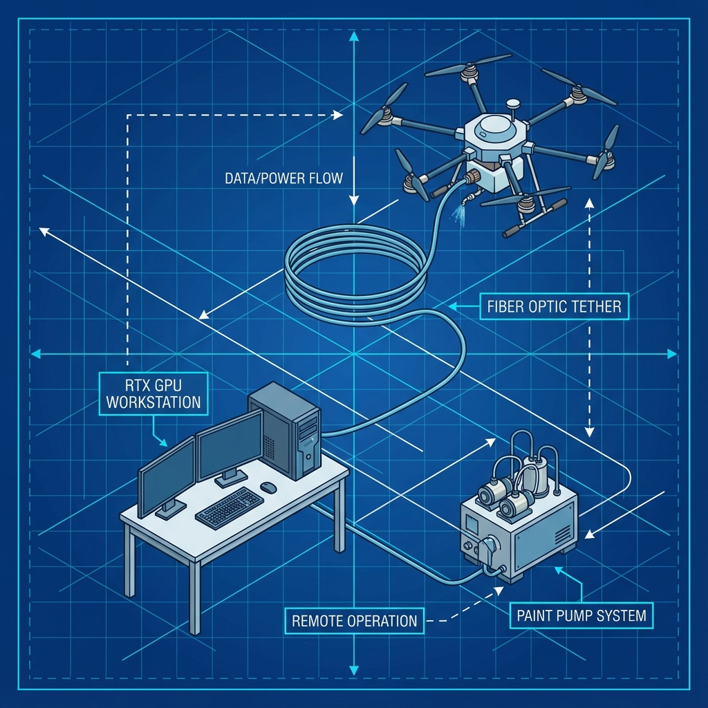
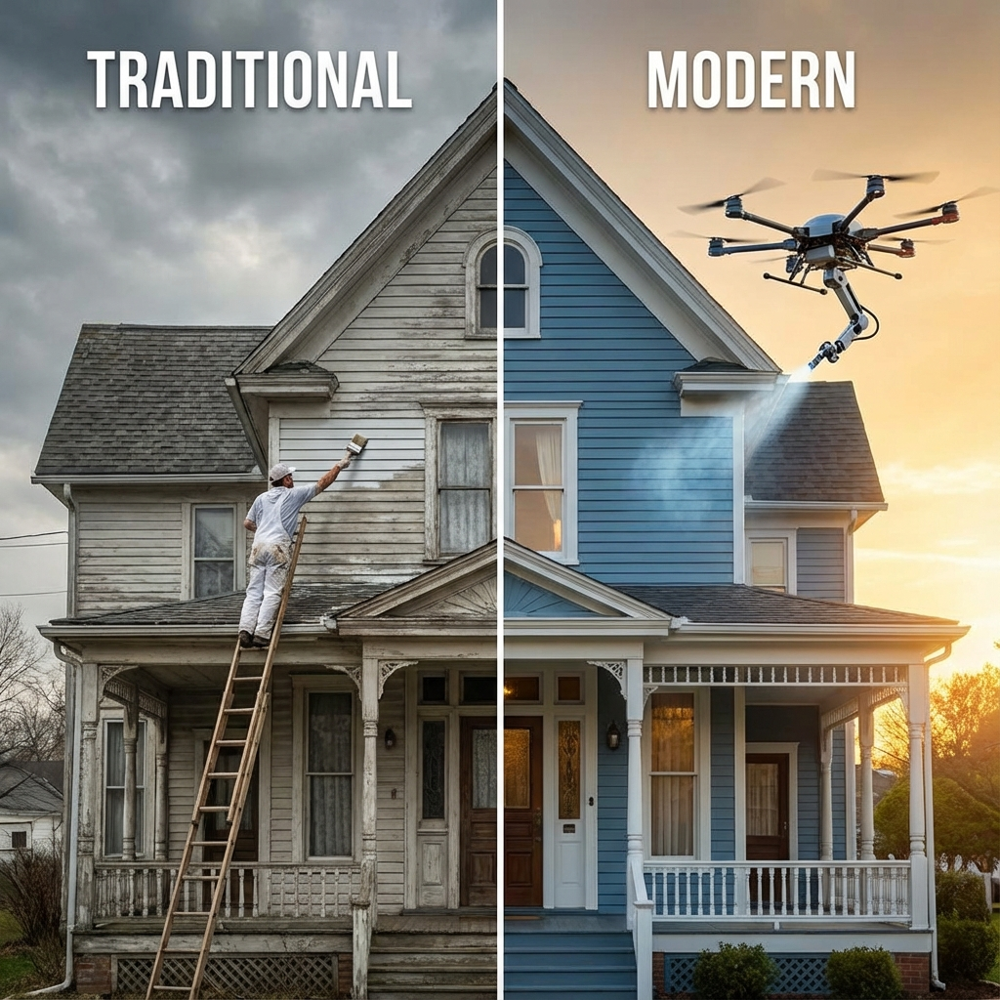

# Drone Painter — Aerostroke

> Can drones paint houses? A deep-dive feasibility study into autonomous UAV exterior painting.

An in-depth business and technical exploration of **autonomous drone house painting** — ground-computed AI control, fiber-optic tethering for power and bandwidth, and the economics of bringing it to market under the "Aerostroke" concept.

## What's inside

- **Business plan** — [`aerostroke_business_plan.html`](aerostroke_business_plan.html): market, model, and go-to-market analysis
- **System architecture** — ground-computed AI + fiber-optic-tethered UAV design

  
- **Results & comparisons** — before/after visualizations

  
- **Methodology & cost analysis** — under [`.agent/forge-benchmark/`](.agent/forge-benchmark/)

## Concept

Robotics meets real estate: a tethered drone carries paint and nozzles while the heavy compute (vision, path planning, surface mapping) stays on the ground, connected by fiber optic for low-latency control and effectively unlimited power.

## Read it

Open [`aerostroke_business_plan.html`](aerostroke_business_plan.html) in a browser for the full study.
